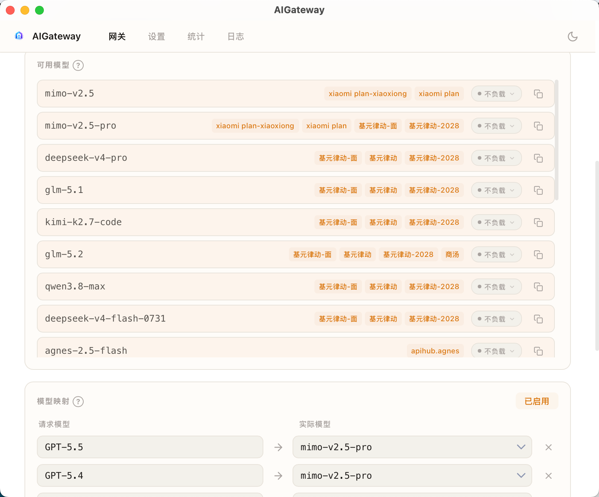

# 🚀 AIGateway

[English](README_EN.md)

本地 AI API 统一代理网关 — 让所有 AI 工具共享一个入口，随意切换后端。

## 🤔 它解决什么问题？

你手上有好几个 AI 工具：Codex CLI、Cursor、CherryStudio、自己写的脚本……每个都直连不同的 API。当你想切换到另一个提供商时——比如从 OpenAI 换到 Anthropic，或者从官方 API 换到中转站——你得逐个修改每个工具的配置。更麻烦的是，有的工具只支持 OpenAI 格式，但你想用的提供商只提供 Anthropic 格式。

**AIGateway 坐在所有工具和所有 API 之间：**

```
┌─ Client ──────────────────────────────────────┐
│  curl · Claude Code · Continue · ChatGPT 等   │
│  统一请求: /v1/chat/completions               │
│  model: "claude-sonnet-4-20250514"            │
└────────────────────┬──────────────────────────┘
                     │ HTTP localhost:9999
┌────────────────────▼──────────────────────────┐
│  AIGateway                                    │
│                                               │
│  ┌─────────────────────────────────────────┐  │
│  │  Model Router（配置驱动）                │  │
│  │  model ID → 匹配 Profile → 协议转换     │  │
│  │                                         │  │
│  │  claude-*   → Anthropic Messages API    │  │
│  │  gpt-*      → OpenAI Chat API           │  │
│  │  gemini-*   → Google Gemini API         │  │
│  │  deepseek-* → DeepSeek API              │  │
│  │  (任意 model ID，配置即路由)             │  │
│  └─────────────────────────────────────────┘  │
└────────────────────┬──────────────────────────┘
           ┌─────────┼─────────┬─────────┐
           ▼         ▼         ▼         ▼
       Anthropic   OpenAI    Google    DeepSeek
       Messages    Chat API  Gemini    API
```

- 📌 工具侧只认一个地址 `http://127.0.0.1:9999`，永远不用改
- 🔄 后端随意切换：在 GUI 里勾选/取消配置即可，工具无感
- 🔀 协议自动转换：用 OpenAI 格式的工具也能调 Anthropic，反过来也行
- 🎯 支持同时启用多个提供商，按模型名自动路由 — 请求中的模型名会按配置的先后顺序匹配提供商，命中即停

## ⚡ 快速开始

### 0️⃣ 下载安装

前往 [GitHub Releases](https://github.com/IronManCantFix/AIGateway/releases) 页面下载对应平台的安装包：

| 平台 | 安装包 |
|---|---|
| macOS | `.dmg`（aarch64 / x86_64） |
| Windows | `.msi` 或 `.exe` |
| Linux | `.deb` 或 `.rpm` |

#### macOS 安装说明

本应用未签名，macOS 的 Gatekeeper 会阻止直接打开。安装后需要手动解除隔离属性：

```bash
# 挂载 dmg 后，将 AIGateway.app 拖入「应用程序」文件夹，然后执行：
sudo xattr -r -d com.apple.quarantine /Applications/AIGateway.app
```


> 未执行上述步骤直接双击打开，会提示"Apple 无法验证此 App"而无法运行。

### 1️⃣ 配置并使用

启动应用后，在主界面添加一条提供商配置：

| 字段 | 示例 | 说明 |
|---|---|---|
| 名称 | `My OpenAI` | 随意命名 |
| 类型 | `openai-chat` | 提供商接口类型 |
| Base URL | `https://api.openai.com` | 不含路径 |
| API Key | `sk-...` | 你的密钥 |
| 默认模型 | `gpt-4o` | 未指定模型时使用 |
| 可用模型 | `gpt-4o`, `gpt-4o-mini` | 该提供商支持的模型列表，用于模型路由匹配和对外暴露可用模型 |

添加可用模型后，首页会展示当前所有可用模型，客户端也可通过 `GET /v1/models` 接口获取模型 ID 列表（OpenAI 兼容格式）。

勾选启用，点击「启动」代理。然后把你的工具指向 `http://127.0.0.1:9999` 即可。


### 2️⃣ 在 Codex CLI或桌面端 中使用

[Codex CLI](https://github.com/openai/codex) 原生支持 OpenAI API，只需设置环境变量指向 AIGateway 代理地址

config.toml文件
```bash
model_provider = "aigateway"
model_override = true

[model_providers.aigateway]
provider_type = "openai"
name = "aigateway"
base_url = "http://127.0.0.1:9999/v1"
wire_api = "responses"
```

模型映射，将GPT-5.4-mini、GPT-5.5、GPT-5.4、GPT-5.3映射成你指定的模型

这样 Codex 的所有请求都经过 AIGateway 代理。当你切换后端提供商时，Codex 完全无感——它看到的始终是 OpenAI 格式的响应。

### 3️⃣ 其他客户端

任何支持自定义 API Base URL 的工具都能接入：

| 工具 | 设置方式 |
|---|---|
| **Cursor** | Settings → OpenAI API Key & Base URL |
| **CherryStudio** | 设置中填入代理地址 |
| **任意 HTTP 客户端** | 请求 `http://127.0.0.1:9999/v1/chat/completions` |

支持的代理接口（`/v1` 前缀可选，`/chat/completions` 和 `/v1/chat/completions` 均可）：

| 接口 | 说明 |
|---|---|
| `POST /v1/chat/completions` | OpenAI Chat Completions 格式 |
| `POST /v1/responses` | OpenAI Responses 格式 |
| `POST /v1/messages` | Anthropic Messages 格式 |
| `GET /v1/models` | 全局模型列表（OpenAI 兼容格式） |

### 📎 系统托盘

关闭窗口时应用最小化到系统托盘。右键托盘图标可以快速启动/停止代理或退出应用。

## 📊 日志与统计

设置页面提供多维度的请求统计和日志查看功能。

### 总览

顶部展示三个核心指标：**总请求数**、**Token 消耗**（Prompt / Completion 明细）、**日均请求**。



### 趋势分析

- **全年热力图** — 按天聚合，GitHub 风格热力图，支持切换「请求数」和「Token」两种视图
- **30 天趋势** — 双轴折线图，同时展示请求数和 Token 消耗走势，悬停查看每日明细

### 分维度统计

- **提供商统计** — 按提供商分组，展示各提供商的请求次数、Token 消耗量，展开查看各模型的调用明细
- **模型统计** — 按模型分组，展示每个模型的调用次数和 Token 用量（Prompt / Completion / Total）

### 请求日志

日志页记录每一次代理请求，支持：

- 按**提供商**、**模型**、**日期范围**筛选
- 分页浏览（每页 5 / 10 / 20 / 50 条）
- 每条日志显示：状态码、接口类型、上游请求地址、提供商、模型、耗时、Token 用量（P / C / T）
- 通过代理发出的请求会显示蓝色 `PROXY` 标签
- 经过模型映射的请求会显示 `原始模型 → 映射后模型 | 提供商`

### 调试日志

在设置中开启「记录请求参数与返回参数」后，每条日志会额外记录完整的请求体和响应体：

1. 进入设置页面，勾选「记录请求参数与返回参数」— 立即生效，无需重启代理
2. 在日志列表中展开「查看参数」，可查看完整的 JSON 请求/响应内容
3. 点击「复制」按钮可快速复制参数用于排查

> ⚠️ 开启调试日志会增加存储占用。可通过「清空参数」按钮清除已记录的请求/响应体（保留统计计数），或「清除日志」删除全部日志。

## 🌐 HTTP 代理

当你的网络环境需要通过代理服务器才能访问上游 API 时，可以配置 HTTP 代理。所有代理请求都会通过你指定的 HTTP/HTTPS/SOCKS5 代理服务器转发。

### 配置方式

1. 打开设置页面，找到「HTTP 代理」配置卡片
2. 启用代理开关，填写代理地址（如 `http://127.0.0.1:7890`）
3. 如需认证，填写用户名和密码（可选）
4. 可选择排除特定提供商配置 — 被排除的配置其请求将不经过代理，直接连接上游

### 托盘快捷开关

系统托盘右键菜单中可快速开关 HTTP 代理，无需打开设置页面。切换后立即生效，无需重启代理。

### 日志标记

通过代理发出的请求会在日志中显示蓝色 `PROXY` 标签，方便识别哪些请求走了代理通道。

## 🏷️ 提供商类型

| providerType | 上游接口 | 典型用途 |
|---|---|---|
| `openai-chat` | `/v1/chat/completions` | OpenAI、中转站、大多数兼容 API |
| `openai-response` | `/v1/responses` | OpenAI Responses API |
| `anthropic-message` | `/v1/messages` | Anthropic Claude API |

## 🔧 协议转换矩阵

代理自动处理客户端请求格式与上游 API 格式之间的交叉转换：

| 客户端请求 | → openai-chat | → openai-response | → anthropic-message |
|---|---|---|---|
| `/v1/chat/completions` | 直接转发 | → `/v1/responses` | → `/v1/messages` |
| `/v1/responses` | → `/v1/chat/completions` | 直接转发 | → `/v1/messages` |
| `/v1/messages` | → `/v1/chat/completions` | → `/v1/responses` | 直接转发 |

SSE 流式响应也会实时转换。

## ✅ 测试说明

目前使用 Codex App 、 Cherry Studio 、Claude App 进行了以下测试：

| 客户端           | 提供商       | 协议                      | 结果 |
|---------------|-----------|-------------------------|---|
| Codex App     | MiMo      | `openai-responses`      | ✅ |
| Codex App     | DeepSeek  | `openai-responses`      | ✅ |
| Codex App     | GLM       | `openai-responses`      | ✅ |
| Cherry Studio | MiniMax   | `openai-chat、Anthropic` | ✅ |
| Cherry Studio | MiMo      | `openai-chat、Anthropic` | ✅ |
| Cherry Studio | DeepSeek  | `openai-chat、Anthropic` | ✅ |
| Cherry Studio | GLM       | `openai-chat、Anthropic` | ✅ |
| Claude App    | GLM       | `Anthropic` | ✅ |
| Claude App    | MiMo      | `Anthropic` | ✅ |
| Claude App    | DeepSeek  | `Anthropic` | ✅ |
| Claude App    | MiniMax   | `Anthropic` | ✅ |

我个人没有把市面上常见的AI工具都下载下来一一测试，只测试了我常用的工具和模型，国外的模型我没有购买所以无法测试。 
目前基本上都是使用流式请求，非流式请求没有进行测试，有bug可以反馈。

> 欢迎提交 Issue 反馈其他模型或客户端的兼容性情况。

## 🛠️ 安装与开发

### 安装依赖

```bash
npm install
cd proxy && bun install && cd ..
```

### 开发模式

```bash
# 编译 Sidecar（首次）
mkdir -p src-tauri/binaries
cd proxy && bun build --compile proxy-server.js --outfile ../src-tauri/binaries/proxy-server && cd ..
TARGET=$(rustc -vV | grep host | cut -d' ' -f2)
ln -sf proxy-server "src-tauri/binaries/proxy-server-$TARGET"

# 启动
npm run tauri dev
```

### 生产构建

```bash
npm run proxy:build   # 编译 Sidecar（所有平台）
npm run tauri build   # 构建应用
```

### 生成应用图标

准备一张 1024x1024 的 PNG 图片，然后运行：

```bash
npx tauri icon <path-to-your-icon.png>
```

该命令会自动生成所有平台（macOS、Windows、Linux、iOS）所需的图标尺寸，输出到 `src-tauri/icons/` 目录。

### 何时需要重新编译代理服务器

代理服务器（`proxy/proxy-server.js`）会被 `bun compile` 编译为独立的二进制文件（Sidecar），嵌入到应用中运行。因此，**修改 `proxy/proxy-server.js` 后必须重新编译才能生效**。

需要重新编译的典型场景：

- 修改了协议转换逻辑（请求体/响应体格式转换）
- 修改了 SSE 流式转换器
- 修改了路由处理（如添加新的 API 端点）
- 修改了代理转发逻辑

不需要重新编译的情况：

- 只修改了前端代码（`src/` 目录下的 Vue 文件）— `npm run tauri dev` 会自动热更新
- 只修改了 Rust 后端代码（`src-tauri/src/`）— `npm run tauri dev` 会自动重新编译
- 只修改了配置文件或 README

**开发模式下重新编译代理（当前平台）：**

```bash
cd proxy && bun build --compile proxy-server.js --outfile ../src-tauri/binaries/proxy-server && cd ..
TARGET=$(rustc -vV | grep host | cut -d' ' -f2)
ln -sf proxy-server "src-tauri/binaries/proxy-server-$TARGET"
```

**生产构建（所有平台）：**

```bash
npm run proxy:build
```

重新编译后需要重启应用才能生效。

## 📦 技术栈

- **前端**：Vue 3 + Vite
- **桌面框架**：Tauri 2.x（Rust 后端）
- **代理服务器**：Node.js 原生 `http` 模块（Sidecar 模式，bun compile 编译为独立二进制）
- **数据存储**：JSON 文件（平台标准应用数据目录）

## 📁 项目结构

```
aigateway/
├── src/                          # Vue 3 前端
│   ├── api.js                    # Tauri invoke 封装
│   ├── App.vue                   # 路由入口
│   └── pages/
│       ├── Home/                 # 主页
│       ├── ProfileEdit/          # 配置编辑
│       └── Settings/             # 设置
├── src-tauri/                    # Tauri Rust 后端
│   ├── src/
│   │   ├── main.rs               # 入口 + 命令注册 + 系统托盘
│   │   ├── config.rs             # JSON 配置存储
│   │   ├── proxy.rs              # Sidecar 进程管理
│   │   └── commands.rs           # Tauri invoke 命令
│   ├── tauri.conf.json           # Tauri 配置
│   └── capabilities/             # 权限配置
├── proxy/                        # Node.js 代理 Sidecar
│   ├── proxy-server.js           # 代理服务器 + 协议转换
│   └── package.json
├── scripts/
│   └── build-proxy.sh            # Sidecar 多平台编译脚本
└── package.json
```

## 🙏 致谢

- 感谢 **DeepSeek V4 Pro** 模型的超高性价比，第一版（[utools 插件版](https://github.com/a471640241/ai-gateway-utools)）完全使用 DeepSeek V4 Pro 开发
- 感谢 **小米 Orbit 百万亿 Token 计划**，提供了免费的 Pro 月度套餐，本桌面版从 utools 版迁移而来，使用 MiMo-V2.5-Pro 开发
- 感谢 **Claude Code** 这么好用的开发工具，让开发效率大幅提升

## 🗓️ 后期计划

- **图像接口兼容** — 支持跨协议的图像请求转换（OpenAI `image_url` ↔ Anthropic `image` 格式），让使用 OpenAI 格式的客户端也能通过 Anthropic 接口发送图片，反之亦然

## 📄 许可证

MIT
